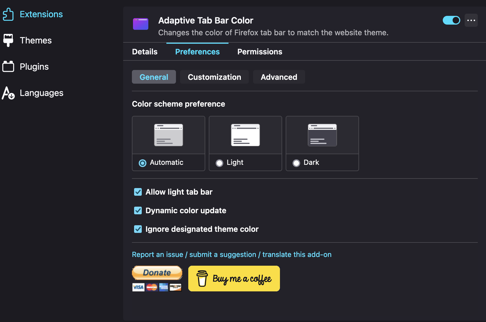

# Custom UI Firefox

Firefox is a popular web browser that is known for its customizability. You can change the look and feel of Firefox by installing themes and extensions. Also can customize the UI by change via css. In this article, I will show you how to customize the Firefox UI using a `userChrome.css` file from the open source project.

<!-- more -->

## What is userChrome.css?

`userChrome.css` is a file that allows you to customize the Firefox user interface. It is a CSS file that can be used to change the appearance of Firefox, such as the color of the tabs, the size of the toolbar buttons, and the spacing between elements. You can use `userChrome.css` to make Firefox look the way you want.

## Why customize Firefox UI?

There are several reasons why you might want to customize the Firefox UI:

- **Personalization**: You can make Firefox look the way you want by customizing the UI.
- **Productivity**: You can make Firefox more efficient by customizing the UI to suit your workflow.
- **Accessibility**: You can make Firefox easier to use by customizing the UI to meet your needs.

## How to customize Firefox UI?

There are open source projects that provide `userChrome.css` files that you can use to customize the Firefox UI. You can search in github or find in website [https://firefoxcss-store.github.io/](https://firefoxcss-store.github.io/). You can also create your own `userChrome.css` file to customize the Firefox UI. But, I will show you how to use the `userChrome.css` file from the open source project.

To customize the Firefox UI using a `userChrome.css` file from the open source project, follow these steps:

1.  **Go to [https://firefoxcss-store.github.io/](https://firefoxcss-store.github.io/)**. Select one of theme that you like. For example, I will use the [`AutoColor-Minimal-Proton`](https://github.com/Neikon/AutoColor-Minimal-Proton) theme. Visit the repository and download the `userChrome.css` file.
2.  **Follow the installation instructions** provided in the repository. Usually, you only need to copy the `userChrome.css` file to the `chrome` folder in your Firefox profile directory.
3.  **Open the Firefox profile directory**. Open a new tab in firefox and write in url bar `about:support`, you should see a list with your firefox data. You only need **"Profile folder"** , you can now click in "Open folder" button o copy the address to your profile folder.

    !!! note "The address should be similar to following example depend of your system:"

          - Linux - `$HOME/.mozilla/firefox/XXXXXXX.default-XXXXXX/`
          - Windows 10 - `C:\Users\<USERNAME>\AppData\Roaming\Mozilla\Firefox\Profiles\XXX.default-XXX`
          - macOS - `Users/<USERNAME>/Library/Application Support/Firefox/Profiles/XXXXXXX.default-XXXXXXX`

4.  **Go to that `XXXXXXX.default-XXXXXXX` folder**. If there is no folder called `chrome`, create it.
5.  **Copy the `userChrome.css`** file that you downloaded to the `chrome` folder.
6.  **Go to firefox** ,open a new tab and write `about:config` in the url bar
7.  A dialog will warn you, but ignore it, just do it press the **`I accept the risk!`** button.
8.  Search this `toolkit.legacyUserProfileCustomizations.stylesheets` and set to **true**.
9.  **Install Extension Adaptive Tab Bar Color** [here](https://addons.mozilla.org/en-US/firefox/addon/adaptive-tab-bar-colour/). Change settings of that extension.
    
10. **Restart** Firefox
11. That's all, after restarting you should be able to see the changes in the Firefox UI.

## Result

<video width="100%"  controls>
    <source src="https://firebasestorage.googleapis.com/v0/b/test-40865.appspot.com/o/custom-ui-firefox.mp4?alt=media&token=12a24cbe-b24f-4a4a-b2a2-fb14bbf80a98" type="video/mp4">
</video>

## Reference

- [Firefox CSS Store](https://firefoxcss-store.github.io/)
- [AutoColor-Minimal-Proton](https://github.com/Neikon/AutoColor-Minimal-Proton/blob/master/README.md)
