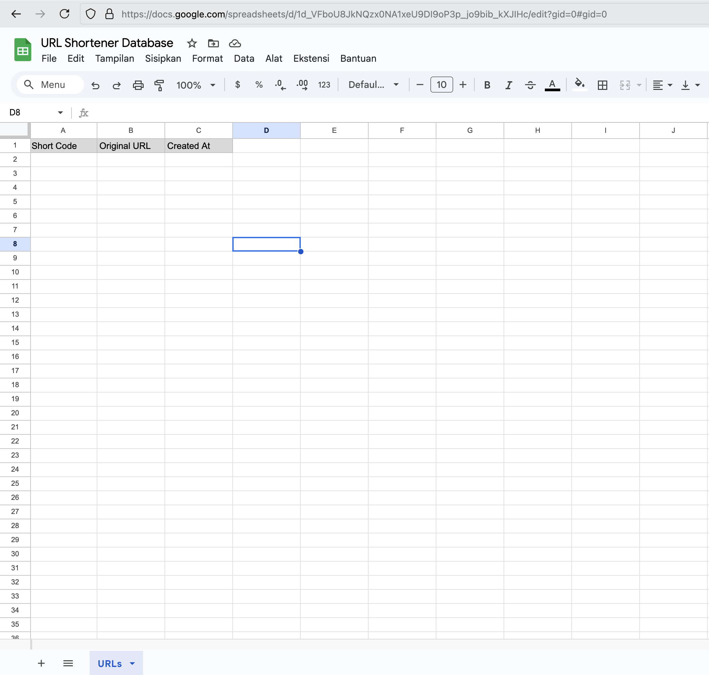
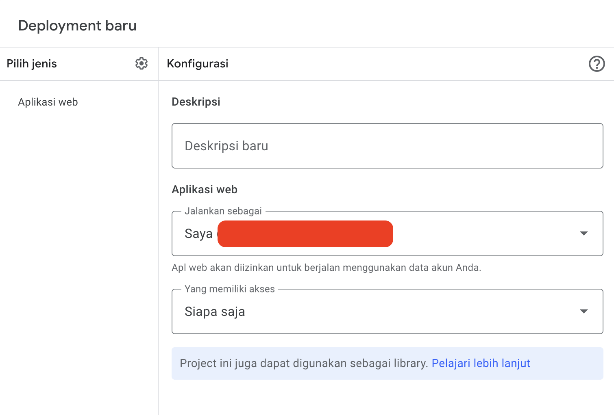

# Use App Script to Create API URL Shortener

In this article, I will show you how to use App Script to create an API URL Shortener. This API will be used to shorten long URLs into shorter ones.

<!-- more -->

## What is Google App Script?

Google App Script is a cloud-based development platform that allows you to create web applications and automate tasks using JavaScript. It is a powerful tool that can be used to create a wide range of applications, from simple scripts to complex web applications. App Script is integrated with Google Drive, Google Sheets, and other Google services, making it easy to access and manipulate data.

## Steps to Create API URL Shortener

To create an API URL Shortener using App Script, follow these steps:

1.  **Create a new Google Sheet**: Open Google Sheets [here](https://docs.google.com/spreadsheets) and create a new spreadsheet.

    a. Fill name sheet, e.g "URL Shortener Database"

    b. Change name sheet, e.g "URLs"

    c. Add header , fill cell A1 with "Short Code", cell B1 with "Original URL" and cell C1 with "Created At"

    d. Save the spreadsheet

    <figure markdown="span">
    
    <figcaption>Setup Google Sheet</figcaption>
    </figure>

    e. Copy SHEET_ID of your sheet, e.g "1d_VFboU8JkNQzx0NA1xeU9DI9oP3p_jo9bib_kXJIHc"

    ```bash title="Copy ID of your sheet from url"
    https://docs.google.com/spreadsheets/d/{SHEET_ID}/edit?gid=0#gid=0
    ```

2.  **Create a new script**: Go to the [script editor](https://script.google.com/home) and create a new script.

    a. Fill name script, e.g "URL Shortener"

    b. Copy code below and paste it to script editor. Change SHEET_ID and SHEET_NAME with your sheet ID and sheet name.

    ```javascript
    const SHEET_ID = '...';
    const SHEET_NAME = 'URLs';

    /**
     * Buat URL pendek baru
     */
    function createShortURL(originalUrl, customShortCode = null) {
      const spreadsheet = SpreadsheetApp.openById(SHEET_ID);
      const sheet = spreadsheet.getSheetByName(SHEET_NAME);
      const data = sheet.getDataRange().getValues(); // Ambil semua kode yang sudah ada
      const existingCodes = data.slice(1).map((row) => row[0]);

      const shortCode = customShortCode || generateShortCode();

      // Jika customShortCode diisi dan sudah ada, kembalikan pesan error
      if (customShortCode && existingCodes.includes(customShortCode)) {
        throw new Error('Short code already exists');
      }

      const createdAt = new Date();
      sheet.appendRow([shortCode, originalUrl, createdAt]);
      return shortCode;
    }

    /**
     * Ambil URL asli berdasarkan kode pendek
     */
    function getOriginalURL(shortCode) {
      const spreadsheet = SpreadsheetApp.openById(SHEET_ID);
      const sheet = spreadsheet.getSheetByName(SHEET_NAME);
      const data = sheet.getDataRange().getValues();

      for (let i = 1; i < data.length; i++) {
        if (data[i][0] === shortCode) {
          return data[i][1];
        }
      }
      return null;
    }

    /**
     * Generate kode pendek acak
     */
    function generateShortCode() {
      const spreadsheet = SpreadsheetApp.openById(SHEET_ID);
      const sheet = spreadsheet.getSheetByName(SHEET_NAME);
      const data = sheet.getDataRange().getValues();
      const existingCodes = data.slice(1).map((row) => row[0]); // Ambil semua kode yang sudah ada

      const chars = 'abcdefghijklmnopqrstuvwxyzABCDEFGHIJKLMNOPQRSTUVWXYZ0123456789';
      let code;
      do {
        code = '';
        for (let i = 0; i < 6; i++) {
          code += chars.charAt(Math.floor(Math.random() * chars.length));
        }
      } while (existingCodes.includes(code)); // Ulangi jika kode sudah ada

      return code;
    }

    /**
     * Endpoint untuk membuat URL pendek
     */
    function doPost(e) {
      try {
        const requestBody = JSON.parse(e.postData.contents);
        const originalUrl = requestBody.originalUrl;
        const customShortCode = requestBody.shortCode || null;

        const shortCode = createShortURL(originalUrl, customShortCode);

        return ContentService.createTextOutput(
          JSON.stringify({ shortCode, status: 'success', code: 201 })
        ).setMimeType(ContentService.MimeType.JSON); // URL successfully created
      } catch (error) {
        if (error.message === 'Short code already exists') {
          return ContentService.createTextOutput(
            JSON.stringify({ error: error.message, status: 'error', code: 409 })
          ).setMimeType(ContentService.MimeType.JSON); // Conflict
        }

        return ContentService.createTextOutput(
          JSON.stringify({ error: error.message, status: 'error', code: 500 })
        ).setMimeType(ContentService.MimeType.JSON); // Server error
      }
    }

    /**
     * Endpoint untuk mengambil URL asli
     */
    function doGet(e) {
      const shortCode = e.parameter.code;
      const originalUrl = getOriginalURL(shortCode);

      if (originalUrl) {
        return ContentService.createTextOutput(
          JSON.stringify({ originalUrl, status: 'success', code: 200 })
        ).setMimeType(ContentService.MimeType.JSON); // OK;
      }

      return ContentService.createTextOutput(
        JSON.stringify({ error: 'URL not found', status: 'error', code: 404 })
      ).setMimeType(ContentService.MimeType.JSON); // Not Found;
    }
    ```

3.  **Apply New Development**: Click `Deploy` -> `New Deployment` -> `Select type` -> `Web App` -> `Deploy`. Make sure permission `Access` is `Anyone, even anonymous`.

    <figure markdown='span'>
    
    <figcaption>Setup Google Script</figcaption>

4.  **Get URL**: Copy the URL and use it in your application.

    ```bash title="Example"
    https://script.google.com/macros/s/AKfycbx4ssZaUSxqscf7fqNQ2etj7q_puUEgl_BWOXRH3eE6VyAfZnRovfDRXNQl9g0_McwaaA/exec
    ```

## API Documentation

| Method | Endpoint | Body                                 | Description            |
| ------ | -------- | ------------------------------------ | ---------------------- |
| POST   | /        | { originalUrl, shortCode(optional) } | Create a new short URL |
| GET    | /?code=  |                                      | Get the original URL   |

## Example

### Create a new short URL

```bash
curl -X POST -H "Content-Type: application/json" -d '{"originalUrl": "https://example.com", "shortCode": "customCode"}' https://script.google.com/macros/s/AKfycbx4ssZaUSxqscf7fqNQ2etj7q_puUEgl_BWOXRH3eE6VyAfZnRovfDRXNQl9g0_McwaaA/exec
```

### Get the original URL

```bash
curl -X GET https://script.google.com/macros/s/AKfycbx4ssZaUSxqscf7fqNQ2etj7q_puUEgl_BWOXRH3eE6VyAfZnRovfDRXNQl9g0_McwaaA/exec?code=customCode
```

## Setup Frontend

Use tech stack or framework of your choice. In my case, I use Next.js to create a simple frontend. See repo [here](https://github.com/solehudin5699/url-shortener).
