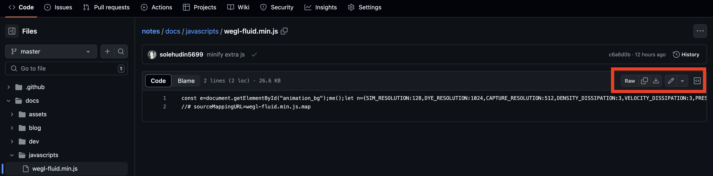

# Use Github as Free CDN

Github is one of the most popular git repository hosting services. But did you know that you can also use Github as a free CDN? In this article, i will show you how to use Github as a free CDN.

## What is CDN?

CDN stands for Content Delivery Network. It is a network of servers that are distributed geographically to deliver web content more efficiently to users. CDN servers are located in different parts of the world, so when a user requests a web page, the content is delivered from the server that is closest to them. This reduces latency and improves the performance of the website.

## Why use Github as a CDN?

There are several reasons why you might want to use Github as a CDN:

- **Free**: Github is free to use, so you can use it as a CDN without any additional cost.
- **Fast**: Github has servers located all over the world, so your content will be delivered quickly to users no matter where they are located.
- **Reliable**: Github has a good track record of uptime and reliability, so you can trust that your content will be available when users request it.
- **Easy to use**: Github is easy to use, so you can quickly set up your content to be delivered via the CDN.

## How to use Github as a CDN

To use Github as a CDN, you need to follow these steps:

1.  **Upload your content to Github**: First, you need to upload the content that you want to deliver via the CDN to a Github repository. You can upload any type of content, such as images, CSS files, JavaScript files, etc.

2.  **Get the raw URL of the content**: Once you have uploaded your content to Github, you need to get the raw URL of the content. To do this, go to the file in your Github repository, click on the "Raw" button, and copy the URL from the address bar.
    <figure markdown="span">
      
      <figcaption>Click Raw button in the opened file</figcaption>
    </figure>

    Or you can using format url like this:

    ```bash
    https://raw.githubusercontent.com/<username>/<repository>/<branch>/path/to/file
    ```

3.  **Use the raw URL in your website**: Finally, you need to use the raw URL of the content in your website. You can link to the raw URL directly in your HTML code, or you can use it in your CSS or JavaScript files.

    For example, if you want to use an image from Github in your website, you can use the following HTML code:

    ```html
    /<repository>/<branch>/path/to/image.jpg"
      alt="Image"
    />
    ```

    Or if you want to use a CSS file from Github in your website, you can use the following HTML code:

    ```html
    <link
      rel="stylesheet"
      href="https://raw.githubusercontent.com/<username>/<repository>/<branch>/path/to/style.css"
    />
    ```

    Or if you want to use a JavaScript file from Github in your website, you can use the following HTML code:

    ```html
    <script src="https://raw.githubusercontent.com/<username>/<repository>/<branch>/path/to/script.js"></script>
    ```

That's it! You have now successfully set up Github as a free CDN for your website.

## Alternative

If you want to use Github as a CDN for your website, but you don't want to use the raw URL of the content, you can use a service like [jsDelivr](https://www.jsdelivr.com/?docs=gh). These services allow you to use Github as a CDN by providing a CDN URL that you can use in your website.

To use jsDelivr as a CDN for your Github content, see docs [here](https://www.jsdelivr.com/?docs=gh).

For example, if you want to use an image from Github in your website using jsDelivr, you can use the following HTML code:

```html
/<repository-github>/path/to/image.jpg"
  alt="Image"
/>
```

Or if you want to use a CSS file from Github in your website using jsDelivr, you can use the following HTML code:

```html
<link
  rel="stylesheet"
  href="https://cdn.jsdelivr.net/gh/<username-github>/<repository-github>/path/to/style.css"
/>
```

Or if you want to use a JavaScript file from Github in your website using jsDelivr, you can use the following HTML code:

```html
<script src="https://cdn.jsdelivr.net/gh/<username-github>/<repository-github>/path/to/script.js"></script>
```

## Conclusion

Using Github as a free CDN is a great way to deliver web content quickly and efficiently to users. Github is free to use, fast, reliable, and easy to use, making it an ideal choice for a CDN. By following the steps outlined in this article, you can easily set up Github as a CDN for your website and improve the performance of your website for users all over the world.
