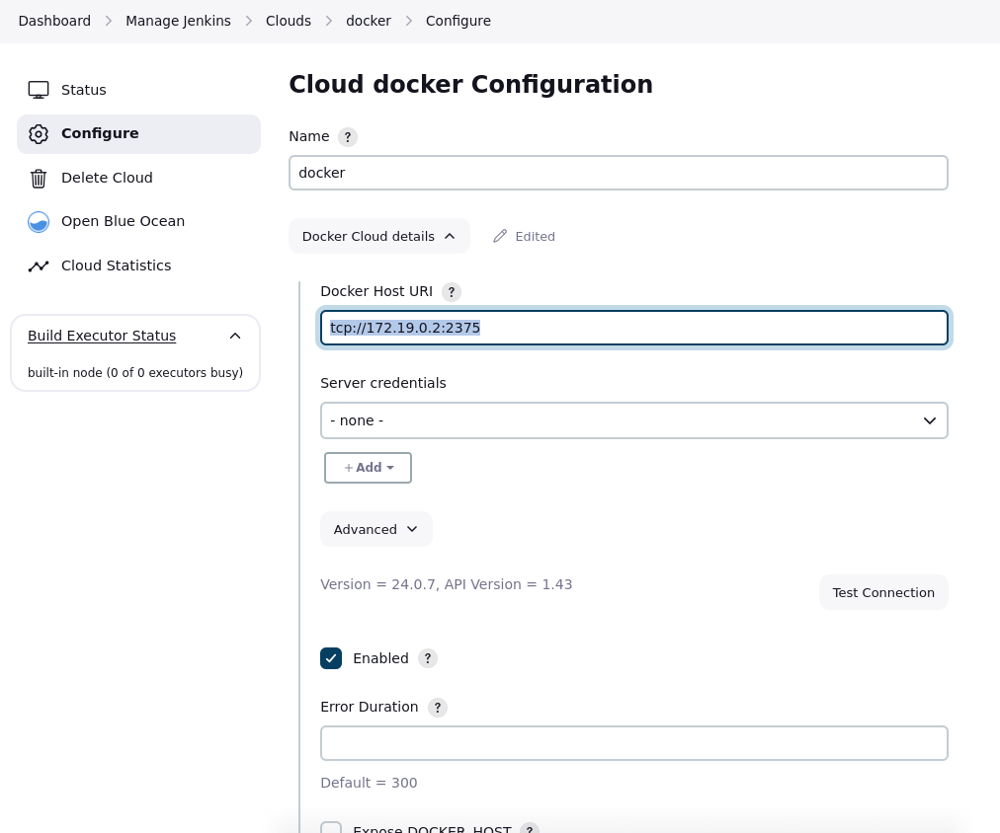
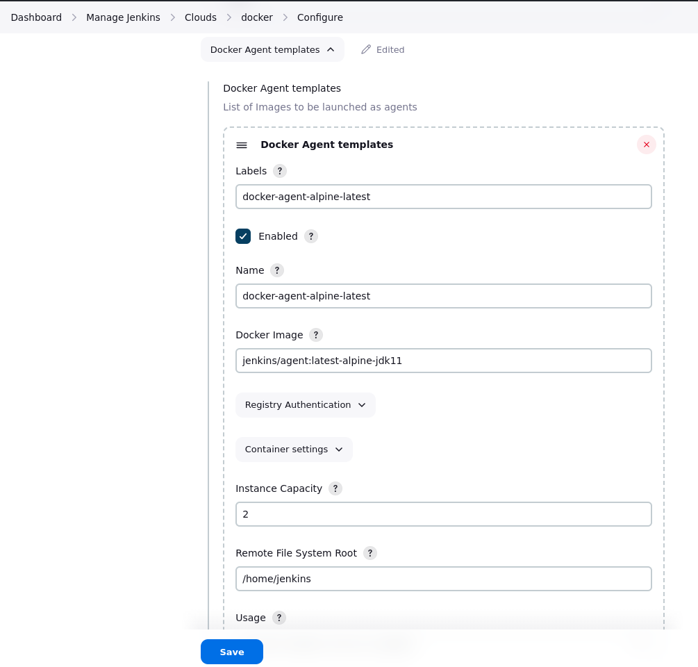

## Overview

---

In previous step, we have installed jenkins as container, a.k.a **jenkins master** or **jenkins controller**.
For run the job, jenkins master will handoff task to jenkins agent.

A **Jenkins agent**, also known as a Jenkins slave, is a worker node in the Jenkins continuous integration and continuous delivery (CI/CD) system that performs build, test, or deployment tasks as directed by the Jenkins controller.

Agents can be set up on various operating systems and can have different configurations, allowing Jenkins to distribute workload across multiple machines.

**Cloud agents**, can be thought of as a collection or pool of agents that are provisioned dynamically from cloud infrastructure resources. These agents are typically spun up on-demand based on workload demands and are managed automatically by Jenkins.

!!! info "Use Case"

    In this case, <br/>(1) i use docker daemon as cloud agent and <br/>(2) use container as clouds agent.

Before next, install plugin Docker at Manage Jenkins > Plugins > Available plugin, search docker, then install.


## Docker daemon (docker host) as clouds

---

Because we run jenkins as container, to setup cloud agent, we must know unix or tcp address of the docker host. But since we are running jenkins as container, the container can't reach docker host unix port.

So, we have to run another container that can mediate between docker host and jenkins container. [See Issue](https://stackoverflow.com/questions/47709208/how-to-find-docker-host-uri-to-be-used-in-jenkins-docker-plugin).

#### Get TCP address docker host

```bash title="Create container"
docker run -d --restart=always \
    --name socat --network jenkins \
    -p 127.0.0.1:2376:2375 \
    -v /var/run/docker.sock:/var/run/docker.sock \
    alpine/socat \
    tcp-listen:2375,fork,reuseaddr unix-connect:/var/run/docker.sock
```

```bash title="Get IPAddress"
docker inspect socat | grep -i IPAddress
#example-->     "SecondaryIPAddresses": null,
#               "IPAddress": "",
#               "IPAddress": "172.19.0.2",
```

Docker host URI is **tcp://172.19.0.2:2375**

#### Config on jenkins master

Go to Dashboard > Manage Jenkins > Clouds > New Cloud, select type Docker

Input Docker Host URI, and test connection


Add Docker Agent templates, and save it, example:


We have set up a clouds and a template agent.

## Container as cloud agent

---

Basically, it's similarly with setup docker host as clouds.
But, to approach it, the container must have docker in it, as know as `docker in docker`.

```bash title="Run docker:dind"
docker run -d --restart=always \
  --name jenkins-docker \
  --privileged \
  --network jenkins \
  --network-alias docker \
  --env DOCKER_TLS_CERTDIR="" \
  --volume jenkins-docker-certs:/certs/client \
  --volume jenkins-data:/var/jenkins_home \
  --publish 2375:2375 \
  docker:dind \
  --storage-driver overlay2
```

Next, we create new cloud, and for Docker Host URI field, we enter **tcp://docker:2375** .
