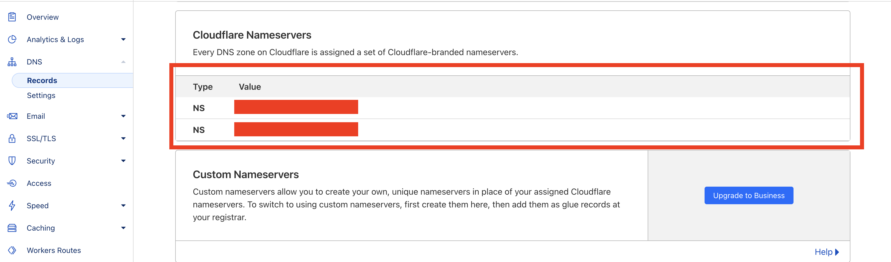
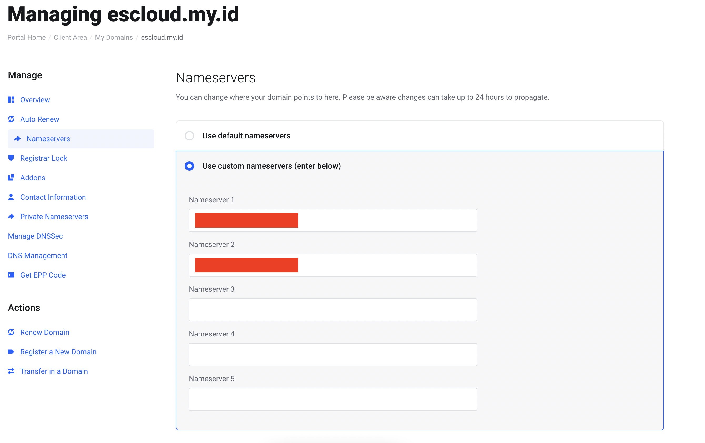
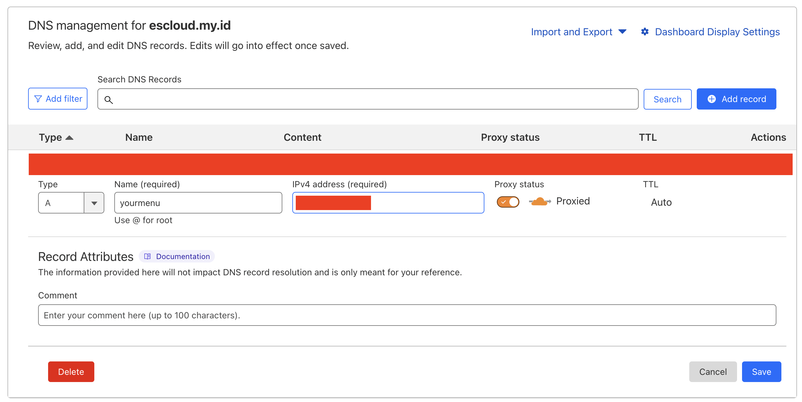

# VPS Setup

Setup VPS on Ubuntu for my personal use. I use VPS for hosting my personal website, blog, testing, and learning purposes.

!!! info "Overview"

      A virtual private server(VPS) is a machine that hosts all the software and data required to run an application or website. It is called virtual because it only consumes a portion of the server's underlying physical resources which are managed by a third-party provider. However, you get access to your dedicated resources on that hardware. [Source: [aws.amazon.com](https://aws.amazon.com/what-is/vps/?nc1=h_ls)].

!!! tip "Disclaimer"

      I use Ubuntu 22.04 LTS for this setup. You can use another version of Ubuntu or another Linux distribution. The steps may vary slightly depending on the distribution you use.

## Update Repositories

```bash title="Access VPS with SSH"
ssh user@ip-address
```

```bash title="Run in terminal"
sudo apt update
sudo apt upgrade
```

## Install Nginx

!!! info "NGINX"

    NGINX is a popular open-source web server that is also used as a reverse proxy, load balancer, and HTTP cache. It was initially designed to solve the C10k problem, which is the difficulty in handling more than 10,000 simultaneous connections. NGINX is known for its high performance, stability, rich feature set, simple configuration, and low resource consumption. It is used by many of the world's largest websites, including Netflix, Airbnb, and GitHub.

```bash linenums="1" title="Run in terminal"
sudo apt update
sudo apt install nginx
```

## Config Nginx for Static Website (Example)

```bash linenums="1" title="Run in terminal"
cd /var/www
sudo chown user:group /html
cd html
git clone [url-static-web-repository]

cd /etc/nginx/sites-available
sudo cp /etc/nginx/sites-available/default /etc/nginx/sites-available/yourmenu.escloud.my.id.conf
```

```bash title="Edit yourmenu.escloud.my.id.conf" linenums="1"
server {
    listen 80;
    listen [::]:80;

    server_name yourmenu.escloud.my.id;

    root /var/www/html/folder-repository;
    index index.html;

    location / {
        try_files $uri $uri/ =404;
    }
}
```

```bash linenums="1" title="Run in terminal"
sudo nginx -t
sudo ln -s /etc/nginx/sites-available/yourmenu.escloud.my.id.conf /etc/nginx/sites-enabled/
sudo service nginx restart
```

## Pointing Domain to VPS + Cloudflare

1. Make sure we have a domain, for example, escloud.my.id. If you don't have a domain, you can buy it from a domain provider.
2. Login to Cloudflare, add site escloud.my.id
   
3. Copy Cloudflare nameserver
   
4. Paste Cloudflare nameserver to domain provider
   
5. Add A record in Cloudflare
   
