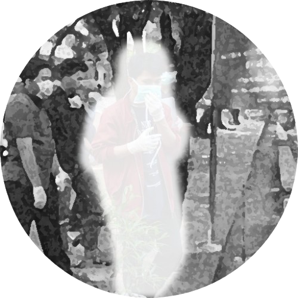

---
hide:
  - navigation
  - toc
  - path
  - footer

template: homepage.html
---

{ align=left width=200}

!!! quote "Hello World!"

    I'm Solehudin, software development enthusiast especially about frontend development. This web is for notes or documentation usage about software development, tools, or other notes.

## Notes about

<!-- 
 -->

!!! success "[Development](/dev/)"

    About software development, like as frontend, backend, devops, etc.

!!! tip "[Tools](/tools/)"

    Contain notes of about tools development.

!!! note "[Blog](/blog/)"

    Blog or other free notes.

<!-- 
 -->
